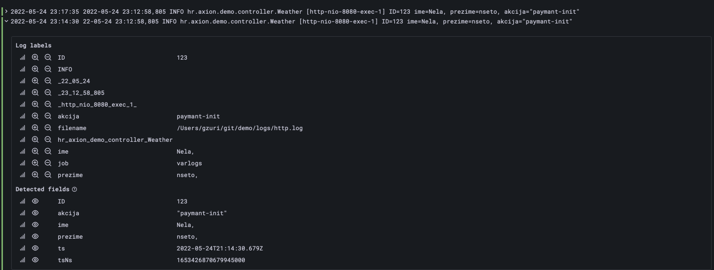

# Observability

## Logging

Every application needs to have proper logging in place in order to function, Spring Boot comes with LogBack and we will use it as is

PROPERLY USE LOG LEVELS!

### Installation

Add the following lines to your application.properties

```
logging.file.name=logs/application.log
logging.level.org.springframework=INFO
logging.pattern.file=%d{yyyy-MM-dd HH:mm:ss} traceID=%X{trace_id} - %msg  %n
logging.level.org.hibernate=error
```

### Usage in code

Initialization and basic usage in the code

```
class ....
    Logger logger = LoggerFactory.getLogger(Weather.class);
    
    method
        logger.info("Updated user with userId={}", userId);
```

IMPORTANT: use proper field names like userId or even combined names like user.address=XXXX if you only use ambiguous names as id it will not help with operations.

The above sample reflect the simple message with the simple payload, you can mix and match with String.formater, objectMappers etc as you need it, as long as the output stays the same

### Structured logging

In order for the logs to be machine-readable they need to be structured so the data points can be easily extracted. The requirement of course can be resolved in different ways, and they include:

* **logfmt**, we will use the format in our Java code by default
* **json**, we can use it where available or if we need to dump some bigger information

### Structured logging with logfmt

additional sources for logfmt:

* [splunk](https://dev.splunk.com/enterprise/docs/developapps/addsupport/logging/loggingbestpractices/)
* [DataDog](https://docs.datadoghq.com/logs/log\_configuration/parsing/?tab=matchers0)
* [Loki (Grafana)](https://grafana.com/blog/2020/10/28/loki-2.0-released-transform-logs-as-youre-querying-them-and-set-up-alerts-within-loki/#filter)

In addition to the regular logging configuration that would have date(UTC) LOG\_LEVEL class message, the message would be structured as a key value pairs that would be parsed in log aggregation system.

```
key1=value1 key2=value2 key3=value3
```

### Custom logger

If there are requirements beyond the capability of yaml/properties config you can put a custom logback-spring.xml in resources folder

```
<?xml version="1.0" encoding="UTF-8"?>
<configuration>

    <property name="LOGS" value="./logs" />

    <appender name="Console"
              class="ch.qos.logback.core.ConsoleAppender">
        <layout class="ch.qos.logback.classic.PatternLayout">
            <Pattern>
                %black(%d{ISO8601}) %highlight(%-5level) [%blue(%t)] %yellow(%C{1.}): %msg%n%throwable
            </Pattern>
        </layout>
    </appender>

    <appender name="RollingFile"
              class="ch.qos.logback.core.rolling.RollingFileAppender">
        <file>${LOGS}/spring-boot-logger.log</file>
        <encoder
                class="ch.qos.logback.classic.encoder.PatternLayoutEncoder">
            <Pattern>%d %p %C{1.} [%t] %m%n</Pattern>
        </encoder>

        <rollingPolicy
                class="ch.qos.logback.core.rolling.TimeBasedRollingPolicy">
            <!-- rollover daily and when the file reaches 10 MegaBytes -->
            <fileNamePattern>${LOGS}/archived/spring-boot-logger-%d{yyyy-MM-dd}.%i.log
            </fileNamePattern>
            <timeBasedFileNamingAndTriggeringPolicy
                    class="ch.qos.logback.core.rolling.SizeAndTimeBasedFNATP">
                <maxFileSize>10MB</maxFileSize>
            </timeBasedFileNamingAndTriggeringPolicy>
        </rollingPolicy>
    </appender>

    <!-- LOG everything at INFO level -->
    <root level="info">
        <appender-ref ref="RollingFile" />
        <appender-ref ref="Console" />
    </root>

    <logger name="hr.axion" level="trace" additivity="false">
        <appender-ref ref="RollingFile" />
        <appender-ref ref="Console" />
    </logger>
</configuration>
```

sources:

* [Grafana official Spring Boot tutorial](https://grafana.com/blog/2022/04/26/set-up-and-observe-a-spring-boot-application-with-grafana-cloud-prometheus-and-opentelemetry/)
*

#### Grafana view

The log message that started as `2022-05-24 23:14:30 22-05-24 23:12:58,805 INFO hr.axion.demo.controller.Weather [http-nio-8080-exec-1] ID=123 ime=Nela, prezime=nseto, akcija="paymant-init"`



## Tracing

To correlate logs we will use OpenTelemetry, for now with auto-instrumentation option that connects directly to JVM via javaagent. In essence there is no custom code or config necessary on the application side

### Local setup

**This step is not necessary for development, it will be enabled on the server!** if you still want to try it out it is rather simple to setup (but you should have a grafana agent pre-installed otherwise you won't see the results).

1. download the latest jar for Java OpenTelemetry [OpenTelemetry Git](https://github.com/open-telemetry/opentelemetry-java)
2. add the following VM options (either when running via console or in IntellJ)

```
-javaagent:/Users/gzuri/git/opentelemetry-javaagent.jar
-Dotel.resource.attributes=service.name=demo-observability
-Dotel.traces.exporter=otlp
-Dotel.exporter.otlp.endpoint=http://127.0.0.1:4317
```

1. change the service.name to reflect the service you are building
2. that's it

sources:

* [Splunk and good information](https://www.splunk.com/en\_us/data-insider/what-is-opentelemetry.html#important-to-devops)
* [Spring boot with Grafana](https://grafana.com/blog/2022/04/26/set-up-and-observe-a-spring-boot-application-with-grafana-cloud-prometheus-and-opentelemetry/https://grafana.com/blog/2022/04/26/set-up-and-observe-a-spring-boot-application-with-grafana-cloud-prometheus-and-opentelemetry/)
* [DataDog](https://docs.datadoghq.com/tracing/setup\_overview/open\_standards/)
* [AWS CloudWatch](https://docs.aws.amazon.com/AmazonCloudWatch/latest/monitoring/CloudWatch-Agent-open-telemetry.html)

## Metrics

Metrics provide a more holistic way of monitoring the systems, things like memory usage, CPU, counter for method hits and relevant events. Spring boot provides metrics out of the box using [Micrometer](https://micrometer.io/) and exposed via Spring Boot Actuators

### Installation

```
<!-- Actuator used for health check endpoint -->
<dependency>
    <groupId>org.springframework.boot</groupId>
    <artifactId>spring-boot-starter-actuator</artifactId>
</dependency>

<!-- Micrometer Prometheus registry  -->
<dependency>
    <groupId>io.micrometer</groupId>
    <artifactId>micrometer-registry-prometheus</artifactId>
    <scope>runtime</scope>
</dependency>
```

### Usage

Metrics can be found at http://localhost:{port}/actuator/metrics or Prometheus exporter at http://localhost:{port}/actuator/prometheus. They are wired automatically and don't need any special configuration for the default behaviour.

#### Custom metrics

Sometimes we need to export custom metrics that will help us monitor our system. In Spring Boot this is really easy, if you are using this method in multiple locations please create a component.

```
class ....
    private final MeterRegistry meterRegistry;
    
    constructor (MeterRegistry meterRegistry)
    {
        this.meterRegistry = meterRegistry;
    }
    
    method
        meterRegistry.counter("order.created", "country", "HR").increment();
```

## Grafana agent config

Local config.file, credentials are some generic Grafana cloud for axion and you can find them in psono or ask Goran

```
server:
  log_level: debug

metrics:
  configs:
  - name: axion-observability
    remote_write:
    - basic_auth:
        username: 441240
        password: eyJrIjoiOGQ0N2EyMGQxMjE2MDljNWNkN2FmYWExYzA0YTIyZTM3NDhlYTQxYyIsIm4iOiJPYnNlcnZhYmlsaXR5IGRlbW8iLCJpZCI6NjUyNDAzfQ==
      url: https://prometheus-prod-01-eu-west-0.grafana.net/api/prom/push
    scrape_configs:
    - job_name: axion-observability
      scrape_interval: 10s
      static_configs:
      - targets:
        - 127.0.0.1:35100
      metrics_path: /actuator/prometheus
      metric_relabel_configs:
        - source_labels: [ 'trace_id' ]
          target_label: 'traceID'

logs:
  configs:
  - name: default
    positions:
      filename: /tmp/positions.yaml
    scrape_configs:
      - job_name: axion-observability
        static_configs:
          - targets: [localhost]
            labels:
              job: syslog
              __path__: /Users/gzuri/git/axion-demo-observability/logs/application.log
    clients:
      - url: https://219590:eyJrIjoiOGQ0N2EyMGQxMjE2MDljNWNkN2FmYWExYzA0YTIyZTM3NDhlYTQxYyIsIm4iOiJPYnNlcnZhYmlsaXR5IGRlbW8iLCJpZCI6NjUyNDAzfQ==@logs-prod-eu-west-0.grafana.net/loki/api/v1/push

traces:
  configs:
  - name: default
    receivers:
      otlp:
        protocols:
          http:
          grpc:
    remote_write:
      - endpoint: tempo-eu-west-0.grafana.net:443
        basic_auth:
          username: 216102
          password: eyJrIjoiOGQ0N2EyMGQxMjE2MDljNWNkN2FmYWExYzA0YTIyZTM3NDhlYTQxYyIsIm4iOiJPYnNlcnZhYmlsaXR5IGRlbW8iLCJpZCI6NjUyNDAzfQ==

integrations:
  node_exporter:
    enabled: true
~                       
```

Running agent locally ( in process not as a service): `grafana-agent % /opt/homebrew/opt/grafana-agent/bin/grafana-agent -config.file /opt/homebrew/etc/grafana-agent/config.yml`

## Lombok

One of the biggest complaints against Java is how much noise can be found in a single class. Project Lombok saw this as a problem and aims to reduce the noise of some of the worst offenders by replacing them with a simple set of annotations.

Most used annotations

* @Getter/@Setter - adds getter / setter
* @ToString - adds toString
* @EqualsAndHashCode - adds equals and hashCode
* @Data - adds everything
